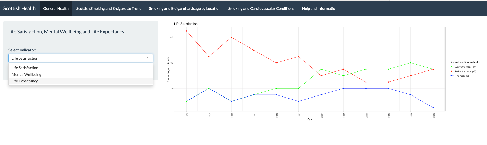
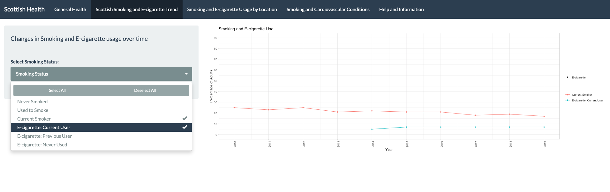
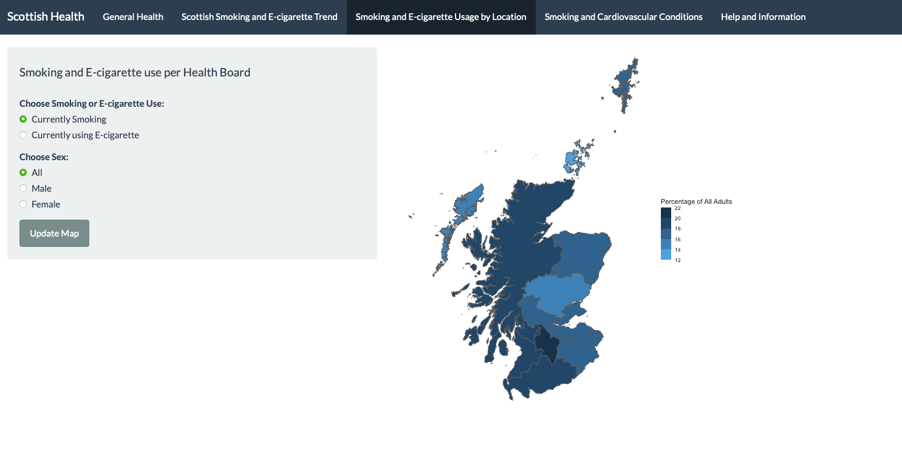
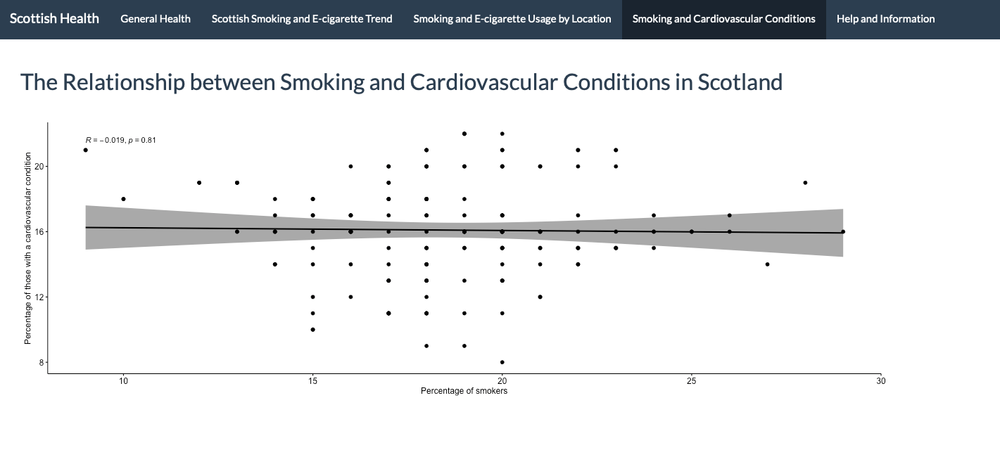

# Group Project
### Scottish Smoking Trends App 

### Hello and welcome to the README page for the smoking app I helped develop.

#### App Bio

This app has two main objectives; the first is to provide an overview of Scottish public health and the second is to provide an overview of the smoking and e-cigarette trend in Scotland.

#### General Health Tab

This tab allows the user to view the general health trend across Scotland by selecting an indicator from the drop down menu. General Health has been operationalised using 'Life Satisfaction', 'Mental Wellbeing' and 'Life Expectancy' as its indicators.

 

#### Scottish Smoking and E-cigarette Trend Tab

This tab allows the user to view smoking and e-cigarette trends. The user can select one or multiple indicators, which will plot the results accordingly.

 

#### Scottish Smoking and E-cigarette Usage by Location Tab

This tab allows the user to view smoking and e-cigarette trends across Scotland on a map. The user can select either 'Smoking' or 'E-cigarette Use' and can also be filtered by sex. The results are then displayed on the map.

 

#### Smoking and Cardiovascular Conditions Tab

According to the CDC, smoking is a major risk factor for cardiovascular disease. The risk of heart attacks drop within a year of quitting smoking. Given this, we carried out a correlation to see if there was a statistically significant relationship between current smokers and cardiovascular conditions. We did not find a statistically significant correlation using the most recently available data.

 

